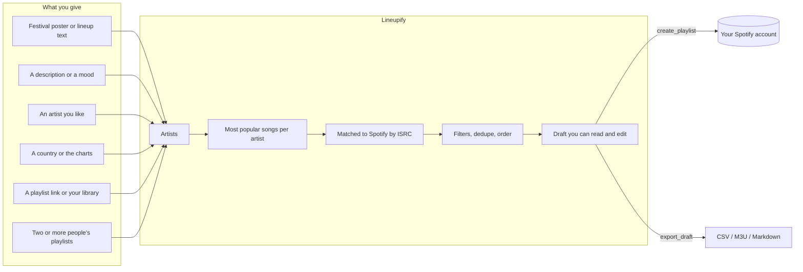
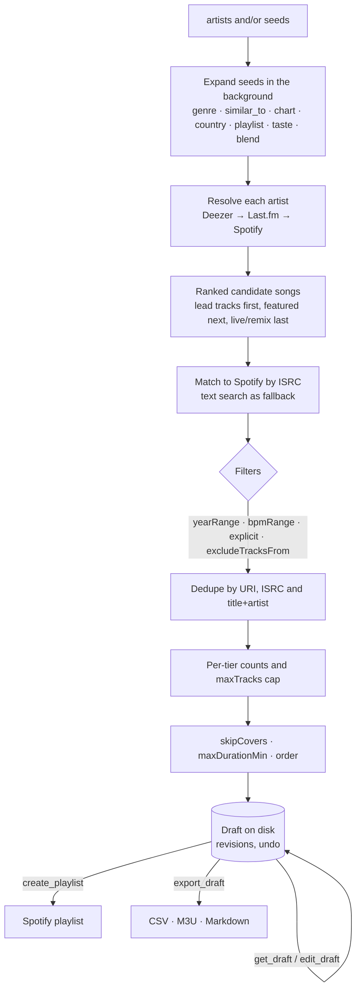
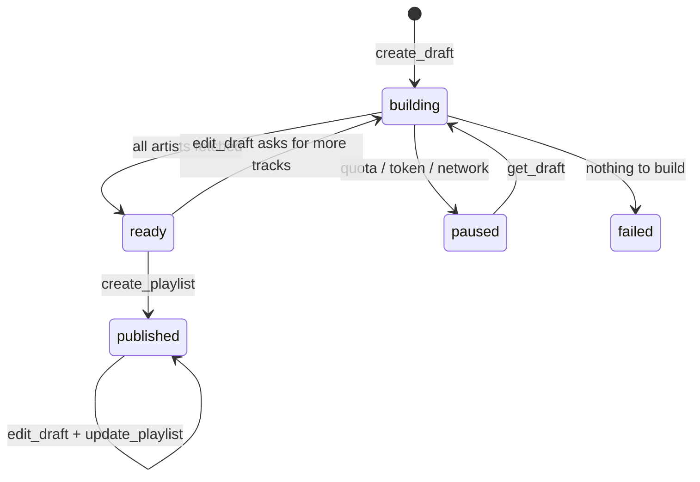

# Lineupify

[](https://github.com/shreeshman/lineupify/actions/workflows/ci.yml) [](https://www.npmjs.com/package/lineupify-mcp) [](LICENSE)

**Say what you want to hear. Get a Spotify playlist in seconds, in your own account, that you can read, edit and trust.**

Lineupify is an MCP server for Claude Desktop, Claude Code, Cursor and any other MCP host. Paste a festival poster, describe a mood, name an artist you like, point at a playlist, or blend two people's playlists. Lineupify finds the artists, picks their most popular songs, matches them to Spotify and builds a draft you can review before anything is published. You bring a free Spotify developer app (two minutes, no client secret). Everything else runs on your machine.

- npm: `lineupify-mcp` (Node.js 20 or newer)
- Guides: [Spotify app setup](docs/setup-spotify.md) · [Hosts](docs/hosts.md) · [Troubleshooting](docs/troubleshooting.md) · [Security](SECURITY.md)

## Why

Streaming apps are good at playing music and bad at letting you say what you want.

- **The daily mixes are not what you are in the mood for.** They are built from what you played, not from what you want to play next.
- **Shuffle keeps serving the same songs and the same artists.** You want new songs by the artists you already love, not the same twenty again.
- **You can describe a feeling but cannot find the genre.** "Rainy Sunday jazz for cooking" is not a category in any app.
- **Adding songs to a playlist takes minutes of searching** when it should take one sentence.
- **A festival lineup is forty names and you know six.** Preparing for it by hand takes an evening.
- **Blend only blends profiles.** You want to compare two playlists, see what they share and why, and get a mix both people will actually like.
- **The algorithm cannot explain itself.** You want to see which artist a song came from and why it was picked, then change it.
- **Your playlist is on Spotify but your friend is not.** You want the list as a file they can use anywhere.

Lineupify answers each of these with a draft you can see, a reason for every track, and a playlist that ends up in your own account.



## Quick start

The one step nobody can skip is creating a Spotify app, because Spotify only lets new apps serve their owner. Everything after that is one command.

1. **Create a Spotify app** (2 minutes). Go to https://developer.spotify.com/dashboard, click *Create app*, pick *Web API*, set the Redirect URI to exactly `http://127.0.0.1:8765/callback`, save, and copy the **Client ID**. No client secret is needed. Full walkthrough: [docs/setup-spotify.md](docs/setup-spotify.md).
2. **Run the guided setup** in a terminal (needs Node.js 20 or newer):

   ```
   npx -y lineupify-mcp init
   ```

   It takes the Client ID, logs you in through your browser, adds Lineupify to Claude Desktop, Claude Code or Cursor (whichever it finds), and runs a health check. Prefer clicking? Claude Desktop users can instead download `lineupify-<version>.mcpb` from the [releases page](https://github.com/shreeshman/lineupify/releases) and double-click it.

   **Or let your assistant do step 2.** If your assistant can run terminal commands (Claude Code, Cursor, and similar), paste this, with your Client ID filled in:

   > Set up the Lineupify MCP server for me. Run `npx -y lineupify-mcp setup --client-id PASTE_CLIENT_ID_HERE`, then `npx -y lineupify-mcp auth` and tell me when to approve the login in my browser, then `npx -y lineupify-mcp install --claude-code` (or `--cursor` / `--claude-desktop` for the host you are running in), then `npx -y lineupify-mcp doctor` and show me the result. Windows users: run npx through `cmd /c`.

   If the server is already added but not connected (the `.mcpb` route, or a hand-written config), paste this in any chat:

   > Call Lineupify's `status` tool. If Spotify is not connected, call `connect` with my Client ID PASTE_CLIENT_ID_HERE, tell me to approve the login in the browser, then call `status` again to confirm.
3. **Ask for a playlist.** Any of these work:
   - "Make me a playlist for this lineup" *(paste the poster text or attach the image)*
   - "Rainy Sunday jazz for cooking, about an hour, nothing explicit"
   - "Artists like Khruangbin, two songs each"
   - "New songs from my favourite artists that I have not liked yet"
   - "What does my friend's playlist have in common with mine? Then make us a mix."

## What a conversation looks like

### A festival

> **You:** Make me a playlist for this lineup.
>
> ```
> SUNFALL FESTIVAL 2026 · 14-16 AUGUST
> FRED AGAIN..   CHARLI XCX
> Jamie xx · Four Tet · Overmono
> Yaeji  Nia Archives  Barry Can't Swim  DJ Fluffhead
> TICKETS ON SALE NOW
> ```

The assistant calls `parse_lineup`, which returns nine artists with tiers and drops the dates and ticket line, then `create_draft` with `lineup: "Sunfall 2026"`. The draft comes back within about 15 seconds; a big lineup keeps building in the background:

```
Draft d_7k2mq "Sunfall 2026 · Lineupify"  rev 1  status ready  spotify: Alex
Artists 9 (resolved 8 · unresolved 1)
Tracks 27 · 1h42m · explicit 6 · via isrc 25 / text 2 · sources dz 27 / lfm 0 / sp 0
Tiers headliner 2×5 · sub 3×3 · undercard 4×2 · order interleave · private
Not found on Deezer or Spotify (1): DJ Fluffhead
Next: get_draft view=tracks to review, get_draft view=unresolved for misses, edit_draft to change, create_playlist with confirm: true to publish.
```

> **You:** Show me the tracks.

```
t_4k2p  #1   Fred again.. – Marea (we've lost dancing)  4:52  dz/isrc  2021
t_c81z  #2   Charli xcx – Von dutch  2:44  dz/isrc [E]  2024
t_m0r3  #3   Jamie xx – Gosh  4:50  dz/isrc  2015
t_9x1c  #4   Four Tet – Baby  3:47  dz/isrc  2020
…
```

> **You:** Drop the Four Tet track "Baby", forget DJ Fluffhead, and publish it.

`edit_draft` removes the track and excludes the artist; `create_playlist` returns the link:

```
Created playlist "Sunfall 2026 · Lineupify" with 26 tracks (1h38m).
URL: https://open.spotify.com/playlist/3cEYpjA9oz9GiPac4AsH4n
```

Later edits go through `edit_draft` followed by `update_playlist`, which replaces the playlist contents in place.

### A mood

> **You:** Rainy Sunday jazz for cooking, about an hour, nothing explicit.

The assistant proposes fitting artists itself, adds a `genre` seed with the same words so the list is not only its own guess, and calls `create_draft` with `maxDurationMin: 60` and `excludeExplicit: true`:

```
Draft d_r47h8 "Rainy Sunday jazz · Lineupify"  rev 1  status ready
Seed genre "rainy sunday jazz" → 7 artists (Deezer playlists: Jazz for a Rainy Sunday Morning, a jazz Sunday in the rain, …)
Filters: clean only
Artists 10 (resolved 10 · unresolved 0)
Tracks 10 · 52:10 · explicit 0 · via isrc 10 / text 0
```

### Two people

> **You:** Compare my "6626" playlist with my listening history, then make a mix we would both like without anything that is already on it.

`compare_playlists` explains the overlap in numbers the assistant turns into words:

```
Compared 2 sides: 6626 (64 tracks, 52 artists) · your listening history (0 tracks, 210 artists)
Shared by all — artists (18): Mitski, My Chemical Romance, Linkin Park, Olivia Rodrigo, …
6626 vs your listening history: artist overlap 7% (18 shared, 0 identical tracks)
Only in 6626 (34): Camila Cabello, Sara Kays, Prelow, …
```

Then `create_draft` with `seeds: [{ type: "blend", sources: ["6626", "me"] }]` and `excludeTracksFrom: ["6626"]`:

```
Seed blend 6626 + me → 10 artists (99 artists on 2+ sides, 10 of the 10 picked on every side)
Excluded tracks from: 6626 (64 tracks)
Tracks 10 · 33:57 · explicit 1
```

## How it works

Every request becomes an artist list, and every artist list goes through the same pipeline. Nothing touches Spotify until you publish.



Why Deezer and Last.fm for ranking? Spotify no longer exposes top tracks, recommendations, related artists, genres or audio features to new apps. Deezer's public API is keyless and gives popularity, related artists, tempo and playlists; Last.fm (optional key) adds tags, similar artists and per-country charts. Spotify is where the playlist ends up, and ISRC codes make the match exact.

A draft is a small state machine, checkpointed to disk after every artist so a killed process resumes where it stopped:



## Tools

| Tool | What it does | Key parameters |
|---|---|---|
| `status` | Call first. Shows connection state (and as whom), setup steps if needed, token expiry, defaults, drafts in progress, cache size, data directory and any read-only mode. | none |
| `setup` | Saves the Spotify Client ID (and optionally a Last.fm key or a fixed redirect port) to `config.json`. | `clientId`, `lastfmApiKey`, `redirectPort` |
| `connect` | Starts the Spotify login: opens the browser and returns the URL immediately. Pass `clientId` to save the app's Client ID in the same call. Refused while a draft is building. | `clientId`, `force` (switch account / re-login) |
| `disconnect` | Forgets the Spotify login; with `purge: true` deletes the whole `~/.lineupify` folder. Tells you where to remove the app's access on Spotify's side. | `purge` |
| `parse_lineup` | Turns raw poster text into a clean artist list with tiers, days and stages; drops dates, stage names and "tickets" lines. | `text` |
| `create_draft` | Builds a draft from artists and/or seeds (genre, similar artist, chart, country, playlist, your taste, a blend). Returns within ~15 s; larger builds continue in the background. | `artists` and/or `seeds`, `lineup`, `name`, `tracksPerTier`, `tracksPerArtist`, `maxTracks`, `maxDurationMin`, `order`, `yearRange`, `bpmRange`, `skipCovers`, `excludeTracksFrom`, … (see below) |
| `get_draft` | Shows a draft: `summary` (default), `tracks` (paged, with stable ids, year and tempo), `artists`, or `unresolved`. Waits for progress while building. Also resumes an interrupted build. | `draftId` (omit for latest), `view`, `offset`, `limit`, `waitSeconds` (max 25) |
| `edit_draft` | Applies one or more edits atomically. Ops: `remove_tracks`, `add_track`, `exclude_artist`, `set_artist_track_count`, `set_artist_source`, `move`, `shuffle`, `reorder`, `set_meta`, `filter`, `undo`. | `draftId`, `ops` (1-50), `expectedRevision` |
| `search_tracks` | Searches Spotify for a track to add manually; supports `track:` / `artist:` filters. | `query`, `limit` (max 10) |
| `create_playlist` | Publishes a ready draft as a new playlist and returns its URL. Requires the draft to have been shown to the user or `confirm: true`. | `draftId`, `confirm`, `allowPartial`, `mode: "new"` |
| `update_playlist` | Replaces the tracks and details of the playlist a draft was published to. Refuses if the playlist changed inside Spotify unless `force: true`. | `draftId`, `force` |
| `compare_taste` | Marks each artist in a draft as known (in your top or followed artists) or new to you. | `draftId`, `reorderKnownFirst` |
| `read_playlist` | Reads any playlist into a list: a Spotify or Deezer link, a playlist name from your library, a draft id, or `library` (liked songs). Views: `summary`, `tracks`, `artists`. Cached 12 h. | `playlist`, `view`, `offset`, `limit`, `refresh` |
| `analyze_playlist` | Numbers about a playlist: length, artist concentration, decades, explicit share, coarse genres (Deezer) and Last.fm tags, sampled tempo. | `playlist`, `genres`, `tempo` |
| `compare_playlists` | Compares 2-4 playlists, drafts, `library` or `me` (your top and followed artists): shared artists and tracks, pairwise overlap, what is distinct to each. | `sources` |
| `merge_playlists` | One deduplicated draft from 1-6 Spotify playlists, drafts or `library`, keeping the actual tracks. | `playlists`, `name`, `order`, `excludeExplicit`, `maxTracks` |
| `expand_playlist` | More songs by the artists of a playlist, minus what it already has. | `playlist`, `limitArtists`, `tracksPerArtist`, plus the build options |
| `refresh_taste` | New songs from your own top and followed artists, minus your liked songs. | `limitArtists`, `tracksPerArtist`, `excludePlaylists`, plus the build options |
| `export_draft` | Returns the draft as Markdown, CSV (with ISRC, year, tempo, Spotify URLs) or M3U. With `save: true` writes a file under `~/.lineupify/exports/`. | `draftId`, `format`, `save`, `overwrite` |
| `list_drafts` | Lists saved drafts, newest first, with status and whether they were published. | none |
| `delete_draft` | Deletes a draft from disk. The Spotify playlist is not touched. | `draftId` |

Errors come back as `CODE: message` plus a `Fix:` line; every code is listed in [docs/troubleshooting.md](docs/troubleshooting.md).

### `edit_draft` operations

| Op | Fields | Notes |
|---|---|---|
| `remove_tracks` | `ids` (from `get_draft view=tracks`, preferred) and/or `indexes` (1-based) | |
| `add_track` | `track` (`spotify:track:` URI, open.spotify.com URL, or `"Artist - Title"`), `artist`, `position` | Use `search_tracks` first for an exact URI. |
| `exclude_artist` | `artist` | Removes the artist's tracks and stops fetching more. |
| `set_artist_track_count` | `artist`, `count` (0-50) | Raising the count fetches more tracks. |
| `set_artist_source` | `artist`, `deezerId` and/or `spotifyArtistId` | Fixes a wrong artist match and refetches. |
| `move` | `id` or `from`, `to` (1-based) | |
| `shuffle` | `seed` | |
| `reorder` | `mode`: `interleave`, `lineup`, `shuffle`, `by_day`, `known_first` | |
| `set_meta` | `name`, `description`, `public` | |
| `filter` | `explicit: true` removes explicit tracks; `versions: false` removes live/remix/edit versions | |
| `undo` | none, must be the only op | Up to 10 revisions are kept. |

While a draft is still building, only `exclude_artist`, `set_artist_track_count`, `set_artist_source`, `filter` and `set_meta` are accepted. Pass `expectedRevision` from the last `get_draft` so an edit never applies to a list you have not seen.

## Seeds: playlists without typing artists

The engine only needs an artist list. A **seed** produces one for you, alone or alongside typed artists.

| Seed | What it adds | Where it comes from |
|---|---|---|
| `{ type: "genre", value: "shoegaze" }` | The artists of that genre, mood or scene; any words work ("melancholic", "rainy sunday jazz"). | Last.fm tag top artists when a key is set; otherwise public Deezer playlists whose titles match, read and counted. |
| `{ type: "similar_to", value: "Khruangbin" }` | Artists like that one (never the artist itself). | Deezer related artists, plus Last.fm similar artists with a key. |
| `{ type: "chart" }` | What is popular right now. | Deezer global chart (plus Last.fm chart). |
| `{ type: "country", value: "Brazil" }` | What a country listens to. | Last.fm geo charts with a key; Deezer's "Top <Country>" chart playlists otherwise. |
| `{ type: "playlist", value: "<link or name>" }` | The artists of a playlist, most frequent first. | Spotify or Deezer playlist, a name from your library, a draft, or `library`. |
| `{ type: "taste" }` | Your own top and followed artists. | Spotify top artists (3 ranges) and follows. |
| `{ type: "blend", sources: ["<playlist>", "me"] }` | Artists 2-4 people would all like: on every side directly, or in the "similar artists" of every side. `minShared` relaxes "every" to "at least N". | The sides' artists expanded through Deezer related artists. |

Each seed adds up to `limit` artists (default 30, max 100) at the `tier` you give (default `flat`, or `undercard` when the typed artists have tiers). Seeds expand in the background build; the summary shows what each produced and why one failed, and a failed seed never blocks the rest.

Recipes the assistant can run in one call:

- **Describe it:** artists it proposes + `seeds: [{ type: "genre", value: "<the words>" }]`.
- **More like this:** `seeds: [{ type: "similar_to", value: "<artist>" }]`, `tracksPerArtist: 2`.
- **90s hip hop:** `seeds: [{ type: "genre", value: "hip hop" }]`, `yearRange: { from: 1990, to: 1999 }`.
- **Running:** any seed + `bpmRange: { min: 160, max: 180 }`.
- **Expand my playlist:** `expand_playlist` (a `playlist` seed + `excludeTracksFrom` the same playlist).
- **New songs from my favourites:** `refresh_taste` (a `taste` seed + `excludeTracksFrom: ["library"]`).
- **Blend for a road trip:** `compare_playlists` to explain the overlap, then `seeds: [{ type: "blend", sources: [...] }]` with `excludeTracksFrom` the same sources so nothing anyone already has is repeated.
- **Merge:** `merge_playlists` keeps the actual tracks and drops duplicates.

`read_playlist`, `analyze_playlist` and `compare_playlists` return plain data lines (counts, decades, genres, tempo buckets, overlap percentages). The assistant turns them into words, tables or charts; the server never draws.

No Spotify account for the other person? `export_draft` gives Markdown, CSV or M3U they can take anywhere.

## `create_draft` options

| Option | Default | Meaning |
|---|---|---|
| `artists` | required unless `seeds` is given | Up to 400 entries. Each is a name string or `{ name, tier, day, stage }`. `tier` is `headliner`, `sub`, `undercard` or `flat`. |
| `seeds` | unset | Up to 8 `{ type, value, limit, tier }` entries; see [Seeds](#seeds-playlists-without-typing-artists). |
| `lineup` | derived from the first seed, else `"Festival lineup"` | Festival name and year, or a short theme, used for the playlist name. |
| `name` | `"<lineup> · Lineupify"` | Playlist name (max 100 chars). The template is configurable (`namingTemplate`). |
| `description` | `"<n> artists, <m> tracks. Built with Lineupify."` | Playlist description (max 300 chars). |
| `tracksPerTier` | `{ headliner: 5, sub: 3, undercard: 2 }` | Tracks per artist by tier. Artists without a tier get `undercard` when any tier is present, otherwise `flat`, which uses the `sub` count. |
| `tracksPerArtist` | unset | Same count for every artist; overrides `tracksPerTier`. |
| `maxTracks` | `250` | Cap on total tracks (1-10,000). Applied stepwise across tiers so headliners keep more. |
| `maxDurationMin` | unset | Trim the finished draft to this many minutes. |
| `order` | `interleave` | `interleave` (spreads artists), `lineup` (artist by artist), `shuffle`, `by_day`, `known_first`. |
| `excludeArtists` | `[]` | Names to skip. |
| `excludeExplicit` | `false` | Skip explicit tracks. |
| `allowVersions` | `false` | Allow live/remix/edit versions. When off, versions are used only if an artist would otherwise come up short. |
| `discoveryOnly` | `false` | Skip artists already in your top or followed artists (applies to seeded artists too). |
| `stopIfUnresolved` | `false` | Refuse to publish while any artist is still not found, so you can fix names first. |
| `days` | unset | Keep only artists tagged with these days (untagged artists are kept). |
| `public` | `false` | Make the playlist public. |
| `sources` | `["deezer", "lastfm", "spotify"]` | Ranking sources, in order. Last.fm only works with a key; Spotify is a last-resort album fallback. |
| `yearRange` | unset | `{ from, to }`: keep only tracks released in this range. A year that comes from a remaster or compilation is treated as unknown; `strictYear: true` drops unknown years too. |
| `bpmRange` | unset | `{ min, max }`: keep only tracks whose Deezer tempo is in range. Tracks without a tempo are kept unless `strictBpm: true`. |
| `skipCovers` | `false` | Drop a song when a more popular artist has the original: checked against the other artists in the draft, then with one Deezer title search per remaining track. |
| `excludeTracksFrom` | unset | Up to 8 playlists (links or names), drafts or `library` whose tracks must never be picked. |

Every summary and publish result ends with the artists that were not found or had no playable Spotify track, and what to do about them. Defaults can be changed permanently with `lineupify-mcp config set` (see Configuration).

## CLI reference

Running `lineupify-mcp` with no arguments serves MCP over stdio; that is what your host runs. The subcommands below are for a normal terminal (`npx -y lineupify-mcp <command>` or, after a global install, `lineupify-mcp <command>`).

| Command | Purpose |
|---|---|
| `init` | Guided setup in one run: Client ID, Spotify login, host install, health check. Each step can be skipped. |
| `setup --client-id <id> [--port <n>] [--lastfm-key <key>]` | Save the Client ID (32 hex chars), a fixed redirect port, or a Last.fm key to `config.json`. With no flags it prints the Spotify setup steps. |
| `auth [--force]` | Log in to Spotify from the terminal (opens the browser, waits up to 5 minutes). `--force` re-logs in or switches account. |
| `logout [--purge]` | Forget the Spotify login. `--purge` also deletes `~/.lineupify` (config, caches, drafts, exports). |
| `doctor` | Checks Node.js, data directory, Client ID, redirect port/URI, token age and scopes, `GET /me`, Deezer reachability and the Last.fm key, then prints MCP config snippets for every host. Exit code 1 if anything failed. |
| `install --claude-desktop \| --claude-code \| --cursor` | Writes the `lineupify` entry into the host's config (a `.bak` copy is kept for Claude Desktop) or runs `claude mcp add` for you. |
| `config get` | Print `config.json` (Last.fm key masked). |
| `config set <key> <value>` | Change a default (keys below). |
| `config reset` | Reset all defaults; keeps Client ID, port and Last.fm key. |
| `config clear-artist <name>` | Forget the cached artist match for a name, so the next draft resolves it again. |
| `preview <lineup.txt> [--per-artist <n>]` | Dry run without Spotify: parses the file, resolves artists on Deezer/Last.fm and prints the songs that would be picked, with ISRCs. |
| `update-check` | Compare the installed version with npm. |
| `--version`, `--help` | |

Example `doctor` output:

```
OK   Node.js          22.11.0
OK   Data dir         /home/alex/.lineupify
OK   Client ID        set (config.json)
OK   Redirect URI     http://127.0.0.1:8765/callback (port free; this exact URI must be in the app's Redirect URIs)
OK   Spotify login    Alex; refresh token valid 171 more days
OK   Spotify API      GET /me ok (alexr)
OK   Deezer           HTTP 200
OK   Last.fm key      not set (optional)
```

## Configuration

Settings are read from environment variables first, then from `~/.lineupify/config.json`. An environment variable always wins over the file.

### Environment variables

| Variable | Purpose |
|---|---|
| `SPOTIFY_CLIENT_ID` | Spotify app Client ID. Alternative to `setup`; overrides `config.json`. |
| `SPOTIFY_REDIRECT_PORT` | Use a different loopback port for the login callback (register `http://127.0.0.1:<port>/callback` in the dashboard). Default 8765. |
| `LASTFM_API_KEY` | Enables Last.fm as a second ranking and discovery source. Free key: https://www.last.fm/api/account/create |
| `LINEUPIFY_HOME` | Data directory. Default `~/.lineupify`. |
| `LINEUPIFY_LOG` | Log level: `error`, `info` (default) or `debug`. Logs go to stderr only (your host's MCP log), never to stdout. Tokens are redacted. |
| `LINEUPIFY_READ_ONLY` | `1` disables `create_playlist` and `update_playlist`. Drafts, reads, analysis and exports keep working. `status` shows the mode. |
| `LINEUPIFY_NO_UPDATE_CHECK` | `1` stops the version check against the npm registry. |

Pass them through your host's `env` block (see [docs/hosts.md](docs/hosts.md)).

### `config.json`

```json
{
  "spotifyClientId": "0123456789abcdef0123456789abcdef",
  "spotifyRedirectPort": 8888,
  "lastfmApiKey": "…",
  "defaults": {
    "tracksPerTier": { "headliner": 5, "sub": 3, "undercard": 2 },
    "maxTracks": 250,
    "order": "interleave",
    "public": false,
    "excludeExplicit": false,
    "allowVersions": false,
    "discoveryOnly": false,
    "skipCovers": false,
    "namingTemplate": "{lineup} · Lineupify"
  }
}
```

`spotifyRedirectPort` and `lastfmApiKey` are optional. Everything under `defaults` is optional and overrides the built-in defaults listed in the options table.

### `config set` keys

| Key | Value |
|---|---|
| `tracksPerTier.headliner`, `tracksPerTier.sub`, `tracksPerTier.undercard` | number |
| `tracksPerArtist`, `maxTracks`, `maxDurationMin` | number |
| `order` | `interleave` / `lineup` / `shuffle` / `by_day` / `known_first` |
| `public`, `excludeExplicit`, `allowVersions`, `discoveryOnly`, `stopIfUnresolved`, `skipCovers` | `true` / `false` |
| `namingTemplate` | text; `{lineup}` is replaced by the lineup name |

Example: `lineupify-mcp config set tracksPerTier.headliner 8`

## Privacy and data

Lineupify runs on your machine with a Spotify app you created. It has no server of its own, no telemetry, and no access to your account beyond the token on your disk. [SECURITY.md](SECURITY.md) lists what it can and cannot do and how to report a problem.

**What is stored**, all under `~/.lineupify/` (or `LINEUPIFY_HOME`):

| File | Contents | Lifetime |
|---|---|---|
| `config.json` | Client ID, defaults, optional Last.fm key | until you change it |
| `tokens.json` | Spotify access and refresh tokens | until `disconnect` / `logout`; refresh tokens die after 6 months anyway |
| `cache/artists.json`, `spotify-tracks.json`, `deezer-tracks.json`, `artist-genres.json`, `covers.json` | artist matches, track lookups, tempo, genres | 30-90 days |
| `cache/playlists.json` | the track lists of playlists you read, including your liked songs when you use `library` | 12 hours |
| `drafts/` | one JSON file per draft plus up to 10 undo revisions | unpublished drafts are deleted after 30 days; published ones kept |
| `exports/` | the only place `export_draft` writes files | until you delete them |

`tokens.json` is written with mode 0600 on macOS and Linux. On Windows that call is a no-op and the file is protected by your user profile's default permissions, the same as other CLIs' credential files.

**Spotify permissions** requested at login, and what needs each one:

| Scope | Needed by |
|---|---|
| `playlist-modify-private` | `create_playlist`, `update_playlist` |
| `playlist-modify-public` | the same, when `public: true` |
| `user-read-private` | market-aware search (`market=from_token`), i.e. every build |
| `user-top-read`, `user-follow-read` | `compare_taste`, `discoveryOnly`, `compare_playlists` with `me`, `taste` and `blend` seeds, `refresh_taste` |
| `playlist-read-private`, `playlist-read-collaborative` | reading your own private playlists, and playlists by name |
| `user-library-read` | `library` (liked songs) in reads, exclusions and `refresh_taste` |

Lineupify never deletes or unfollows a playlist, never changes your library or follows, and creates playlists private unless you ask for public. The only overwrite is `update_playlist` on a playlist Lineupify created, and it refuses if that playlist changed inside Spotify unless forced.

**Where data goes.** Lineupify talks to `api.spotify.com` and `accounts.spotify.com` (your account), `api.deezer.com` (keyless, no account), `ws.audioscrobbler.com` (only with a Last.fm key) and `registry.npmjs.org` (a version check at most every 6 hours; `LINEUPIFY_NO_UPDATE_CHECK=1` turns it off). Artist names, track titles and ISRCs from your playlists, liked songs and top artists are sent to Deezer as search queries for ranking, tempo, genres and cover checks, and to Last.fm when a key is set. No account identifier goes with them. If you would rather keep your listening data out of Deezer, use typed artist lists with `sources: ["spotify"]` and skip `analyze_playlist`, `bpmRange` and `skipCovers`.

**Switches.**

- `LINEUPIFY_READ_ONLY=1` disables `create_playlist` and `update_playlist`; everything else works. Good for "analysis only" setups.
- `disconnect` (tool) or `lineupify-mcp logout` forgets the login; `purge: true` / `--purge` deletes the whole data folder. Remove the app's access on Spotify's side at https://www.spotify.com/account/apps/.
- Your MCP host can disable the server entirely (Claude Desktop: Settings → Developer; Claude Code: `claude mcp remove lineupify`).

**Model-driven writes.** `create_playlist` refuses until the draft has been shown to you, unless the assistant passes `confirm: true`. Like any MCP server, Lineupify does what the assistant asks; the write tools carry MCP `destructiveHint` annotations so hosts that ask for permission can single them out. Review the draft before publishing, or run read-only.

**External text.** Poster text, track titles, playlist descriptions and Deezer playlist names are cleaned (control characters stripped, length capped) and shown inside fixed table layouts, so they cannot pose as instructions. Logs go to stderr only, with tokens and keys redacted.

**Terms.** Last.fm data is for non-commercial use. Deezer's public API has its own terms of use. Check both before using Lineupify for a business (a venue, a radio schedule).

## Limits and known issues

- **Spotify Development Mode.** New Spotify apps run in Development Mode: at most 5 users, and the app owner must have Spotify Premium. Production ("Extended Quota Mode") is only granted to registered businesses with 250,000+ monthly active users, so every Lineupify user creates their own free app instead. Other people can only use your app if you add them under *User Management* in the dashboard.
- **6-month logins.** Spotify refresh tokens expire 6 months after the original login. `status` warns when 30 days are left; reconnect with `connect` `force: true` (or `lineupify-mcp auth --force`).
- **Daily quota.** Development Mode has a daily request quota shared across all apps you own. When it runs out Lineupify reports `SPOTIFY_QUOTA_EXCEEDED`, the draft is paused, and `get_draft` resumes it once the quota resets. Results already fetched are cached, so nothing is lost.
- **60-second hosts.** Claude Desktop and Cursor time out any tool call after 60 s and ignore progress notifications. `create_draft` therefore returns within about 15 s and keeps building in the background; poll with `get_draft` `waitSeconds: 25`. Claude Code has no such limit.
- **Ranking without Spotify.** Spotify removed artist top-tracks, recommendations and popularity for new apps, so songs are ranked with Deezer's public API and optionally Last.fm, then matched to Spotify by ISRC. Very small or brand-new acts may not be on Deezer; they show up as unresolved. Adding a Last.fm key helps; `add_track` covers the rest.
- **Size.** Up to 400 artists per draft (split bigger lineups by day; seeds fill the remaining room) and 250 tracks by default (`maxTracks`, up to 10,000).
- **Reading playlists.** Playlists made by Spotify itself (Discover Weekly, Blend, Today's Top Hits, Daily Mix) cannot be read by new apps; playlists made by people can, when public or in your own library. Reads are capped at 1,000 tracks (3,000 for liked songs). If `status` lists missing permissions after an upgrade, reconnect with `connect` `force: true`.
- **Genres and tempo.** Spotify gives new apps no genres or audio features, so `analyze_playlist` uses Deezer's coarse genres (Pop, Rock, Metal, …), Last.fm tags when a key is set, and Deezer tempo sampled over up to 60 tracks. Remastered releases carry the remaster year, so `yearRange` treats them as unknown unless `strictYear` is on.
- **Seeds without a Last.fm key** rely on public Deezer playlists for genre and country; results are good for common genres and large countries and thinner for niche tags. A Last.fm key (`setup lastfmApiKey`) adds tag, similar-artist and per-country data.
- **One builder at a time.** If two hosts (for example Claude Desktop and Claude Code) run Lineupify at once, only one of them builds a given draft; the other reads it.
- **npx caching.** `npx -y lineupify-mcp` keeps the first version it downloaded. Update with `npm i -g lineupify-mcp@latest` or `npx -y lineupify-mcp@latest`. `status` tells you when a newer version exists.

## Development

```
npm install
npm run typecheck && npm run lint && npm test   # unit tests, offline (Spotify and Deezer mocked)
npm run test:live                                # live Deezer checks
npm run smoke:spotify                            # every Spotify endpoint, needs a connected account
npx tsx test/smoke/playlists.ts <playlist link>  # reads, analysis and seeds against live APIs
npm run build                                    # dist/
npm run bundle:mcpb                              # build/lineupify-<version>.mcpb for Claude Desktop
```

Changes are listed in [CHANGELOG.md](CHANGELOG.md).

## Credits

- Song ranking, related artists, tempo and playlist data from the [Deezer](https://www.deezer.com) public API.
- Powered by [Last.fm](https://www.last.fm) data when a `LASTFM_API_KEY` is configured. Last.fm data is for non-commercial use.
- Playlists are created through the [Spotify Web API](https://developer.spotify.com/documentation/web-api).
- Built on the [Model Context Protocol](https://modelcontextprotocol.io) (`@modelcontextprotocol/server`).

Lineupify is not affiliated with Spotify, Deezer or Last.fm.

## License

MIT. See [LICENSE](LICENSE).
