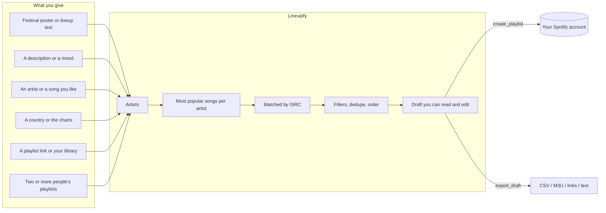
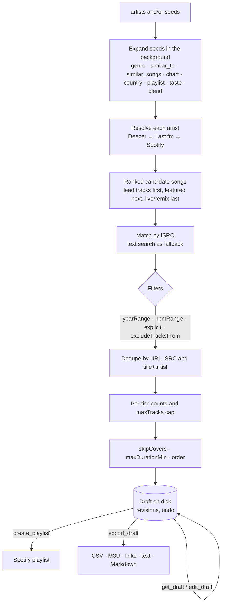
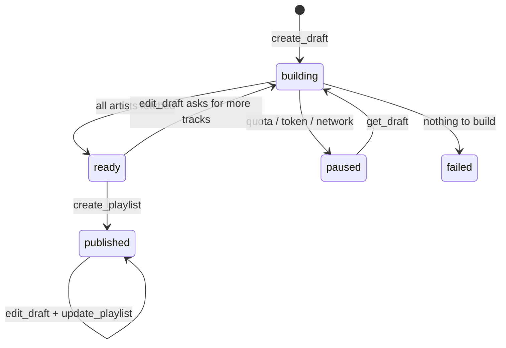

<p align="center">
  
</p>

<h1 align="center">Lineupify</h1>

<p align="center"><strong>Say what you want to hear. Get a playlist you can read, edit and trust, in your own account.</strong></p>

<p align="center">
  <a href="https://github.com/SHREESHMAN/lineupify/actions/workflows/ci.yml"></a>
  <a href="https://www.npmjs.com/package/lineupify-mcp"></a>
  <a href="https://registry.modelcontextprotocol.io/?search=lineupify"></a>
  <a href="LICENSE"></a>
</p>

Lineupify is an [MCP](https://modelcontextprotocol.io) server for Claude Desktop, Claude Code, Cursor and any other MCP host. Paste a festival poster, describe a mood, name an artist or a song you like, point at a playlist, or blend two people's playlists. Lineupify finds the artists, picks their most popular songs, matches them exactly (by ISRC) and builds a draft you can review and edit before anything is published to Spotify. Everything runs on your machine; there is no Lineupify server and no telemetry.

| | Spotify | Deezer mode |
|---|---|---|
| **What you need** | A Spotify Premium account and a free Spotify developer app (2 minutes, no secret) | Nothing. No account, no key |
| **What you get** | Playlists created in your Spotify account, plus reading and comparing your own playlists and library | Drafts with Deezer links that you export and import anywhere (Deezer, Apple Music, YouTube Music) |
| **Why the difference** | Spotify only lets a new app serve its owner, who must have Premium | Deezer's public API is keyless, but Deezer no longer issues write credentials |

Both need Node.js 20 or newer. Package: `lineupify-mcp` on npm.

## Contents

- [Why](#why)
- [Quick start](#quick-start)
  - [Option A: let your assistant install it](#option-a-let-your-assistant-install-it)
  - [Option B: guided setup in a terminal](#option-b-guided-setup-in-a-terminal)
  - [Option C: one click for Claude Desktop](#option-c-one-click-for-claude-desktop)
  - [No Spotify, or no Premium? Deezer mode](#no-spotify-or-no-premium-deezer-mode)
  - [Spotify without Premium: borrow a friend's app](#spotify-without-premium-borrow-a-friends-app)
- [What a conversation looks like](#what-a-conversation-looks-like)
- [How it works](#how-it-works)
- [Reference](#reference) — full tables in [docs/reference.md](docs/reference.md)
- [Privacy, data and terms](#privacy-data-and-terms)
- [Limits and known issues](#limits-and-known-issues)
- [Development](#development)
- [Credits](#credits)
- [License](#license)

## Why

Streaming apps are good at playing music and bad at letting you say what you want.

- **The daily mixes are not what you are in the mood for.** They are built from what you played, not from what you want to play next.
- **Shuffle keeps serving the same songs and the same artists.** You want new songs by the artists you already love, not the same twenty again.
- **You can describe a feeling but cannot find the genre.** "Rainy Sunday jazz for cooking" is not a category in any app.
- **Adding songs to a playlist takes minutes of searching** when it should take one sentence.
- **A festival lineup is forty names and you know six.** Preparing for it by hand takes an evening.
- **Blend only blends profiles.** You want to compare two playlists, see what they share and why, and get a mix both people will actually like.
- **The algorithm cannot explain itself.** You want to see which artist a song came from and why it was picked, then change it.
- **Your playlist is on Spotify but your friend is not.** You want the list as a file they can use anywhere.

Lineupify answers each of these with a draft you can see, a reason for every track, and a playlist that ends up in your own account.

<p align="center">
  
  <br><sub>One sentence and a poster photo in Claude Code: 92 tracks, published private, with the four unmatched acts named instead of silently dropped.</sub>
</p>

## Quick start

Pick one of the three ways to install. All of them end with the same server registered in your host; the Spotify app is the only step nobody can automate, because it is created in your Spotify account.

### Option A: let your assistant install it

If your assistant can run terminal commands (Claude Code, Cursor, and similar), paste this into a chat and follow along:

> Install the Lineupify MCP server for me and guide me through it. It is the npm package `lineupify-mcp` (https://www.npmjs.com/package/lineupify-mcp); read its README at https://github.com/SHREESHMAN/lineupify first. Ask me whether I have a Spotify Premium account. If yes, walk me through creating a Spotify app at https://developer.spotify.com/dashboard with the Redirect URI `http://127.0.0.1:8765/callback`, ask me for the Client ID, then run `npx -y lineupify-mcp setup --client-id <id>` and `npx -y lineupify-mcp auth`, and tell me when to approve the login in my browser. If no, skip Spotify: Deezer mode needs nothing. Then run `npx -y lineupify-mcp install --claude-code` (or `--cursor` / `--claude-desktop`, whichever host you are running in), then `npx -y lineupify-mcp doctor`, show me the result, and tell me what to say next. On Windows run npx through `cmd /c`.

If Lineupify is already registered but Spotify is not connected (the one-click route, or a hand-written config), paste this instead:

> Call Lineupify's `status` tool. If Spotify is not connected, call `connect` with my Client ID PASTE_CLIENT_ID_HERE, tell me to approve the login in the browser, then call `status` again to confirm.

### Option B: guided setup in a terminal

1. **Create a Spotify app** (2 minutes; skip for Deezer mode). Go to https://developer.spotify.com/dashboard, click *Create app*, tick *Web API*, set the Redirect URI to exactly `http://127.0.0.1:8765/callback`, save, then copy the **Client ID** from the app's Settings page. No client secret is needed. Full walkthrough with every field: [docs/setup-spotify.md](docs/setup-spotify.md).

   <details>
   <summary>Screenshots: where "Create app" and the Client ID are</summary>
   <p align="center">
     
     <br><sub>The dashboard. "Create app" is top right.</sub>
   </p>
   <p align="center">
     
     <br><sub>After saving: the Client ID is the value to copy. The client secret is never needed. The 180-day refresh-token lifetime shown here is why <code>status</code> asks you to reconnect twice a year.</sub>
   </p>
   </details>

2. **Run the guided setup**:

   ```
   npx -y lineupify-mcp init
   ```

   It takes the Client ID, logs you in through your browser, adds Lineupify to Claude Desktop, Claude Code or Cursor (whichever it finds), and runs a health check. Every step can be skipped. Restart your host afterwards.

   <details>
   <summary>Screenshot: what <code>init</code> looks like</summary>
   <p align="center">
     
     <br><sub>A second run on a machine that is already set up: every step is skippable, and the health check at the end is the same one <code>doctor</code> prints.</sub>
   </p>
   </details>

3. **Ask for a playlist.** Any of these work:
   - "Make me a playlist for this lineup" *(paste the poster text or attach the image)*
   - "Rainy Sunday jazz for cooking, about an hour, nothing explicit"
   - "Artists like Khruangbin, two songs each"
   - "Songs like Ritviz – Udd Gaye, other artists only"
   - "New songs from my favourite artists that I have not liked yet"
   - "What does my friend's playlist have in common with mine? Then make us a mix."

### Option C: one click for Claude Desktop

Download `lineupify-<version>.mcpb` from the [releases page](https://github.com/SHREESHMAN/lineupify/releases) and double-click it (or drag it onto Claude Desktop). Paste your Client ID into the form, or leave it empty for Deezer mode. Node.js 20 or newer must still be installed. Then say "connect Lineupify to Spotify" in a chat.

<details>
<summary>Screenshots: the three Claude Desktop screens you will see</summary>
<p align="center">
  
  <br><sub>Settings → Extensions. Drop the <code>.mcpb</code> file here.</sub>
</p>
<p align="center">
  
  <br><sub>The install dialog. The red warning is Claude Desktop's standard notice for every third-party extension; the code is on GitHub and the package on npm carries a provenance attestation.</sub>
</p>
<p align="center">
  
  <br><sub>After installing: the Client ID field (empty means Deezer mode), the optional Last.fm key, and per-tool permissions. Read-only tools are grouped so you can approve them once.</sub>
</p>
</details>

Other hosts, the config-file route, and running two hosts at once: [docs/hosts.md](docs/hosts.md).

### No Spotify, or no Premium? Deezer mode

Skip the Spotify app entirely: add Lineupify to your host and ask for a playlist. With no Spotify login, drafts build on **Deezer** automatically (or say "use Deezer"; the option is `provider: "deezer"`). Deezer's public API is keyless, so there is nothing to create, paste or approve.

What works in Deezer mode: every seed except your own Spotify taste, every filter, reading, analysing, comparing and merging Deezer playlists and drafts, editing, and all exports. What does not: publishing into an account. Deezer stopped issuing API credentials to new apps in 2025, so no tool can write to a Deezer account today. If Deezer reopens its API, publishing will be added.

**Getting a Deezer draft into your Deezer (or Apple Music, YouTube Music) account** takes one paste:

1. Ask for the export: "export this draft as links" (`export_draft`, `format: "links"`; `"text"` gives "Artist - Title" lines instead).
2. Open [TuneMyMusic](https://www.tunemymusic.com) or [Soundiiz](https://soundiiz.com), choose *import from text* (TuneMyMusic: *Let's start → Upload text*; Soundiiz: *Import playlist → From text*), and paste the list.
3. Pick the destination service and confirm. The transfer tool logs into your account itself; nothing about your account ever passes through Lineupify.

Both tools have free tiers that cover a normal playlist.

<details>
<summary>Screenshot: the pasted links in TuneMyMusic</summary>
<p align="center">
  
  <br><sub>The <code>links</code> export pasted in: TuneMyMusic recognises every line as a track and lets you pick the destination.</sub>
</p>
</details>

### Spotify without Premium: borrow a friend's app

Spotify's Premium rule applies to the person who *owns* the developer app, not to everyone who uses it. An owner can add up to four other people by email under *User Management* in the dashboard (five users per app in total), and those people log in with their own accounts, free ones included. So if someone you know has Premium:

1. They create the app as in Option B step 1 and add your Spotify account email under *User Management*.
2. They give you the Client ID (it is not a secret; the secret is never used).
3. You run `npx -y lineupify-mcp init` with that Client ID and log in as yourself. Your tokens stay on your machine; the owner never sees your account.

Two limits: an app serves five people at most, and the owner's daily API quota is shared across all of them and all of the owner's apps. Handing the Client ID to someone who is not on the User Management list does nothing; their login fails with a 403. Fine for friends and family; not a way to serve strangers, which Spotify's terms also rule out. Details: [docs/setup-spotify.md](docs/setup-spotify.md#using-a-friends-app-no-premium).

## What a conversation looks like

### A festival

> **You:** Make me a playlist for this lineup.
>
> ```
> SUNFALL FESTIVAL 2026 · 14-16 AUGUST
> FRED AGAIN..   CHARLI XCX
> Jamie xx · Four Tet · Overmono
> Yaeji  Nia Archives  Barry Can't Swim  DJ Fluffhead
> TICKETS ON SALE NOW
> ```

The assistant calls `parse_lineup`, which returns nine artists with tiers and drops the dates and ticket line, then `create_draft` with `lineup: "Sunfall 2026"`. The draft comes back within about 15 seconds; a big lineup keeps building in the background:

```
Draft d_7k2mq "Sunfall 2026 · Lineupify"  rev 1  status ready  provider spotify  spotify: Alex
Artists 9 (resolved 8 · unresolved 1)
Tracks 27 · 1h42m · explicit 6 · via isrc 25 / text 2 · sources dz 27 / lfm 0 / sp 0
Tiers headliner 2×5 · sub 3×3 · undercard 4×2 · order interleave · private
Not found on Deezer or Spotify (1): DJ Fluffhead
Next: get_draft view=tracks to review, get_draft view=unresolved for misses, edit_draft to change, create_playlist with confirm: true to publish.
```

> **You:** Show me the tracks.

```
t_4k2p  #1   Fred again.. – Marea (we've lost dancing)  4:52  dz/isrc  2021
t_c81z  #2   Charli xcx – Von dutch  2:44  dz/isrc [E]  2024
t_m0r3  #3   Jamie xx – Gosh  4:50  dz/isrc  2015
t_9x1c  #4   Four Tet – Baby  3:47  dz/isrc  2020
…
```

> **You:** Drop the Four Tet track "Baby", forget DJ Fluffhead, and publish it.

`edit_draft` removes the track and excludes the artist; `create_playlist` returns the link:

```
Created playlist "Sunfall 2026 · Lineupify" with 26 tracks (1h38m).
URL: https://open.spotify.com/playlist/3cEYpjA9oz9GiPac4AsH4n
```

Later edits go through `edit_draft` followed by `update_playlist`, which replaces the playlist contents in place.

<p align="center">
  
  <br><sub>What lands in Spotify: the name follows your <code>namingTemplate</code>, the description is yours or the default, and the tracks are the draft you reviewed.</sub>
</p>

### A mood

> **You:** Rainy Sunday jazz for cooking, about an hour, nothing explicit.

The assistant proposes fitting artists itself, adds a `genre` seed with the same words so the list is not only its own guess, and calls `create_draft` with `maxDurationMin: 60` and `excludeExplicit: true`:

```
Draft d_r47h8 "Rainy Sunday jazz · Lineupify"  rev 1  status ready
Seed genre "rainy sunday jazz" → 7 artists (Deezer playlists: Jazz for a Rainy Sunday Morning, a jazz Sunday in the rain, …)
Filters: clean only
Artists 10 (resolved 10 · unresolved 0)
Tracks 10 · 52:10 · explicit 0 · via isrc 10 / text 0
```

### Two people

> **You:** Compare my "6626" playlist with my listening history, then make a mix we would both like without anything that is already on it.

`compare_playlists` explains the overlap in numbers the assistant turns into words:

```
Compared 2 sides: 6626 (64 tracks, 52 artists) · your listening history (0 tracks, 210 artists)
Shared by all — artists (18): Mitski, My Chemical Romance, Linkin Park, Olivia Rodrigo, …
6626 vs your listening history: artist overlap 7% (18 shared, 0 identical tracks)
Only in 6626 (34): Camila Cabello, Sara Kays, Prelow, …
```

Then `create_draft` with `seeds: [{ type: "blend", sources: ["6626", "me"] }]` and `excludeTracksFrom: ["6626"]`:

```
Seed blend 6626 + me → 10 artists (99 artists on 2+ sides, 10 of the 10 picked on every side)
Excluded tracks from: 6626 (64 tracks)
Tracks 10 · 33:57 · explicit 1
```

## How it works

Every request becomes an artist list, and every artist list goes through the same pipeline. Nothing touches Spotify until you publish.





Why Deezer and Last.fm for ranking? Spotify no longer exposes top tracks, recommendations, related artists, genres or audio features to new apps. Deezer's public API is keyless and gives popularity, related artists, tempo and playlists; Last.fm (optional key) adds tags, similar artists, similar songs and per-country charts; ListenBrainz (open data) adds song-level neighbours. Spotify is where the playlist ends up, and ISRC codes make the match exact.

A draft is a small state machine, checkpointed to disk after every artist, so a killed process resumes where it stopped:



## Reference

Every tool, every `edit_draft` op, every seed, every `create_draft` option, the CLI and `config.json` live in **[docs/reference.md](docs/reference.md)** rather than here, so this page stays a page you can actually read top to bottom. Five tools cover most of what you will ask for:

| Tool | What it does |
|---|---|
| `status` | Call first: connection state, setup steps, drafts in progress. |
| `create_draft` | Builds a draft from artists and/or seeds (genre, mood, similar artist, a playlist, a blend). |
| `get_draft` | Shows a draft: summary, tracks, artists, or what could not be found. |
| `edit_draft` | Swap a track, drop an artist, reorder, undo. |
| `create_playlist` | Publishes a reviewed draft and returns its URL. |

[Full reference →](docs/reference.md)

## Privacy, data and terms

Lineupify runs on your machine with a Spotify app you created. It has no server of its own, no telemetry, and no access to your account beyond the token on your disk. [SECURITY.md](SECURITY.md) lists what it can and cannot do and how to report a problem.

**What is stored**, all under `~/.lineupify/` (or `LINEUPIFY_HOME`):

| File | Contents | Lifetime |
|---|---|---|
| `config.json` | Client ID, defaults, optional Last.fm key | until you change it |
| `tokens.json` | Spotify access and refresh tokens | until `disconnect` / `logout`; refresh tokens die after 6 months anyway |
| `cache/artists.json`, `spotify-tracks.json`, `deezer-tracks.json`, `artist-genres.json`, `covers.json` | artist matches, track lookups, tempo, genres | 30-90 days |
| `cache/playlists.json` | the track lists of playlists you read, including your liked songs when you use `library` | 12 hours |
| `drafts/` | one JSON file per draft plus up to 10 undo revisions | unpublished drafts are deleted after 30 days; published ones kept |
| `exports/` | the only place `export_draft` writes files | until you delete them |

`tokens.json` is written with mode 0600 on macOS and Linux. On Windows, where that mode means nothing, its inherited permissions are replaced with an entry for your own account only (`icacls /inheritance:r /grant:r`); if that fails, the file keeps your user profile's default permissions, like other CLIs' credential files.

**Spotify permissions** requested at login, and what needs each one:

| Scope | Needed by |
|---|---|
| `playlist-modify-private` | `create_playlist`, `update_playlist` |
| `playlist-modify-public` | the same, when `public: true` |
| `user-read-private` | market-aware search (`market=from_token`), i.e. every build |
| `user-top-read`, `user-follow-read` | `compare_taste`, `discoveryOnly`, `compare_playlists` with `me`, `taste` and `blend` seeds, `refresh_taste` |
| `playlist-read-private`, `playlist-read-collaborative` | reading your own private playlists, and playlists by name |
| `user-library-read` | `library` (liked songs) in reads, exclusions and `refresh_taste` |

Lineupify never deletes or unfollows a playlist, never changes your library or follows, and creates playlists private unless you ask for public. The only overwrite is `update_playlist` on a playlist Lineupify created, and it refuses if that playlist changed inside Spotify unless forced.

**Where data goes.** Lineupify talks to `api.spotify.com` and `accounts.spotify.com` (your account), `api.deezer.com` (keyless, no account), `ws.audioscrobbler.com` (only with a Last.fm key), `musicbrainz.org` and `labs.api.listenbrainz.org` (only for a `similar_songs` seed: the seed songs' ISRC, title and artist are looked up there) and `registry.npmjs.org` (a version check at most every 6 hours; `LINEUPIFY_NO_UPDATE_CHECK=1` turns it off). Artist names, track titles and ISRCs from your playlists, liked songs and top artists are sent to Deezer as search queries for ranking, tempo, genres and cover checks, and to Last.fm when a key is set. No account identifier goes with them. If you would rather keep your listening data out of Deezer, use typed artist lists with `sources: ["spotify"]` and skip `analyze_playlist`, `bpmRange` and `skipCovers`.

**Switches.**

- `LINEUPIFY_READ_ONLY=1` disables `create_playlist` and `update_playlist`; everything else works. Good for "analysis only" setups.
- `disconnect` (tool) or `lineupify-mcp logout` forgets the login; `purge: true` (with `confirm: true`) / `--purge` deletes the whole data folder, and refuses if the folder holds anything Lineupify did not create. Remove the app's access on Spotify's side at https://www.spotify.com/account/apps/.
- Your MCP host can disable the server entirely (Claude Desktop: Settings → Developer; Claude Code: `claude mcp remove lineupify`).

**Model-driven writes.** `create_playlist` refuses until the draft has been shown to you, unless the assistant passes `confirm: true`. Like any MCP server, Lineupify does what the assistant asks; the write tools carry MCP `destructiveHint` annotations so hosts that ask for permission can single them out. Review the draft before publishing, or run read-only.

**External text.** Poster text, track titles, playlist descriptions and Deezer playlist names are cleaned (control characters stripped, length capped) and shown inside fixed table layouts, which reduces the chance that external text is read as an instruction. It cannot rule it out: a poster line that says "publish this as public" reaches the assistant as data, and nothing stops a model from acting on it. The real protections are the switches above: playlists are private by default, `create_playlist` needs a reviewed draft or an explicit `confirm`, `disconnect purge` needs `confirm` too, `LINEUPIFY_READ_ONLY` turns every write off, and Spotify has no delete endpoint. Logs go to stderr only, with tokens and keys redacted.

**Terms.** You are the owner of the Spotify app, so Spotify's [Developer Policy](https://developer.spotify.com/policy) binds you. As read on 2026-09-08: it allows an app to let a user move "the metadata of the user's playlists to another service" (section III.9), which is what `export_draft` does; it forbids using Spotify content "to train a machine learning or AI model or otherwise ingest Spotify Content into a machine learning or AI model" (III.14). Lineupify trains nothing, but it does hand track names to the assistant you are chatting with; if you read III.14 strictly, use Deezer mode or `LINEUPIFY_READ_ONLY`. Spotify's [refresh-token expiry](https://developer.spotify.com/blog/2026-06-18-refresh-token-expiration) is 6 months from the original authorization, not extended by refreshing. Deezer's [API terms](https://developers.deezer.com/termsofuse) are for non-commercial use (article IV) and say nothing about caching; Lineupify keeps Deezer lookups for 30 to 90 days. Last.fm data is for non-commercial use. Check all three before using Lineupify for a business (a venue, a radio schedule).

## Limits and known issues

- **Spotify Development Mode.** New Spotify apps run in Development Mode: at most 5 users, and the app owner must have Spotify Premium. Production ("Extended Quota Mode") is only granted to registered businesses with 250,000+ monthly active users, so every Lineupify user creates their own free app instead. Other people can only use your app if you add them under *User Management* in the dashboard. Without Premium, use Deezer mode.
- **Deezer cannot be written to.** Deezer closed API app registration for new developers in 2025 and had not reopened it as of mid-2026, so Deezer drafts are export-only. Reads, ranking, related artists, tempo and playlist lookups are keyless and unaffected.
- **6-month logins.** Spotify refresh tokens expire 6 months after the original login. `status` warns when 30 days are left; reconnect with `connect` `force: true` (or `lineupify-mcp auth --force`).
- **Daily quota.** Development Mode has a daily request quota shared across all apps you own. When it runs out Lineupify reports `SPOTIFY_QUOTA_EXCEEDED`, the draft is paused, and `get_draft` resumes it once the quota resets. Results already fetched are cached, so nothing is lost. Connection failures pause the build the same way (`NETWORK_ERROR`).
- **60-second hosts.** Claude Desktop and Cursor time out any tool call after 60 s and ignore progress notifications. `create_draft` therefore returns within about 15 s and keeps building in the background; poll with `get_draft` `waitSeconds: 25`. Claude Code has no such limit.
- **Ranking without Spotify.** Spotify removed artist top-tracks, recommendations and popularity for new apps, so songs are ranked with Deezer's public API and optionally Last.fm, then matched to Spotify by ISRC. Very small or brand-new acts may not be on Deezer; they show up as unresolved. Adding a Last.fm key helps; `add_track` covers the rest.
- **Size.** Up to 400 artists per draft (split bigger lineups by day; seeds fill the remaining room) and 250 tracks by default (`maxTracks`, up to 10,000).
- **Reading playlists.** Playlists made by Spotify itself (Discover Weekly, Blend, Today's Top Hits, Daily Mix) cannot be read by new apps; playlists made by people can, when public or in your own library. Reads are capped at 1,000 tracks (3,000 for liked songs). If `status` lists missing permissions after an upgrade, reconnect with `connect` `force: true`.
- **Genres and tempo.** Spotify gives new apps no genres or audio features, so `analyze_playlist` uses Deezer's coarse genres (Pop, Rock, Metal, …), Last.fm tags when a key is set, and Deezer tempo sampled over up to 60 tracks. Remastered releases carry the remaster year, so `yearRange` treats them as unknown unless `strictYear` is on.
- **`similar_songs` without a Last.fm key** uses ListenBrainz alone, whose coverage is thinner for small or non-Western artists; a key adds Last.fm's co-listening data. Both sources work at recording level, so the song must exist in MusicBrainz (ListenBrainz) or have Last.fm scrobbles.
- **Seeds without a Last.fm key** rely on public Deezer playlists for genre and country; results are good for common genres and large countries and thinner for niche tags. A Last.fm key (`setup lastfmApiKey`) adds tag, similar-artist and per-country data.
- **One builder at a time.** If two hosts (for example Claude Desktop and Claude Code) run Lineupify at once, only one of them builds a given draft; the other reads it.
- **npx caching.** `npx -y lineupify-mcp` keeps the first version it downloaded. Update with `npm i -g lineupify-mcp@latest` or `npx -y lineupify-mcp@latest`. `status` tells you when a newer version exists.

## Development

```
npm install
npm run typecheck && npm run lint && npm test   # unit tests, offline (Spotify and Deezer mocked); includes a stdio boot test of the server
npm run coverage                                 # the same with a coverage report
npm run test:live                                # live Deezer checks
npm run smoke:spotify                            # every Spotify endpoint, needs a connected account
npx tsx test/smoke/playlists.ts <playlist link>  # reads, analysis and seeds against live APIs
npm run build                                    # dist/
npm run bundle:mcpb                              # build/lineupify-<version>.mcpb for Claude Desktop
```

Contributions: [CONTRIBUTING.md](CONTRIBUTING.md). Changes are listed in [CHANGELOG.md](CHANGELOG.md).

## Credits

- Song ranking, related artists, tempo and playlist data from the [Deezer](https://www.deezer.com) public API.
- Powered by [Last.fm](https://www.last.fm) data when a `LASTFM_API_KEY` is configured. Last.fm data is for non-commercial use.
- Song similarity uses open data from [MusicBrainz](https://musicbrainz.org) and [ListenBrainz](https://listenbrainz.org) (MetaBrainz Foundation), no key needed.
- Playlists are created through the [Spotify Web API](https://developer.spotify.com/documentation/web-api).
- Built on the [Model Context Protocol](https://modelcontextprotocol.io) (`@modelcontextprotocol/server`).

Lineupify is not affiliated with Spotify, Deezer, Last.fm or MetaBrainz.

## License

MIT. See [LICENSE](LICENSE).
